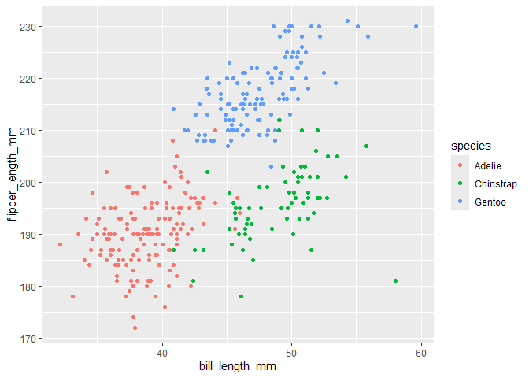

P8105 HW1 cmh2275
================

# Problem 1

``` r
library(tidyverse)
```

    ## ── Attaching core tidyverse packages ──────────────────────── tidyverse 2.0.0 ──
    ## ✔ dplyr     1.2.1     ✔ readr     2.2.0
    ## ✔ forcats   1.0.1     ✔ stringr   1.6.0
    ## ✔ ggplot2   4.0.3     ✔ tibble    3.3.1
    ## ✔ lubridate 1.9.5     ✔ tidyr     1.3.2
    ## ✔ purrr     1.2.2     
    ## ── Conflicts ────────────────────────────────────────── tidyverse_conflicts() ──
    ## ✖ dplyr::filter() masks stats::filter()
    ## ✖ dplyr::lag()    masks stats::lag()
    ## ℹ Use the conflicted package (<http://conflicted.r-lib.org/>) to force all conflicts to become errors

``` r
data("penguins", package = "palmerpenguins")
```

# Description of Penguins Dataset

- The Penguins data set contains the following variables: bill_depth_mm,
  bill_length_mm, body_mass_g, flipper_length_mm, island, sex, species,
  year.
- The Penguins dataset contains 344 rows and 8 columns.
- The mean flipper length is 200.9152047 mm.

# Bill Length vs Flipper Length Scatterplot

``` r
ggplot(penguins, aes(x = bill_length_mm, y = flipper_length_mm, color = species)) + geom_point()
```

    ## Warning: Removed 2 rows containing missing values or values outside the scale range
    ## (`geom_point()`).

<!-- --> \#
Saving Scatterplot

``` r
ggsave ("hw1_billvsflipper_scatterplot.png")
```

    ## Saving 7 x 5 in image

    ## Warning: Removed 2 rows containing missing values or values outside the scale range
    ## (`geom_point()`).
